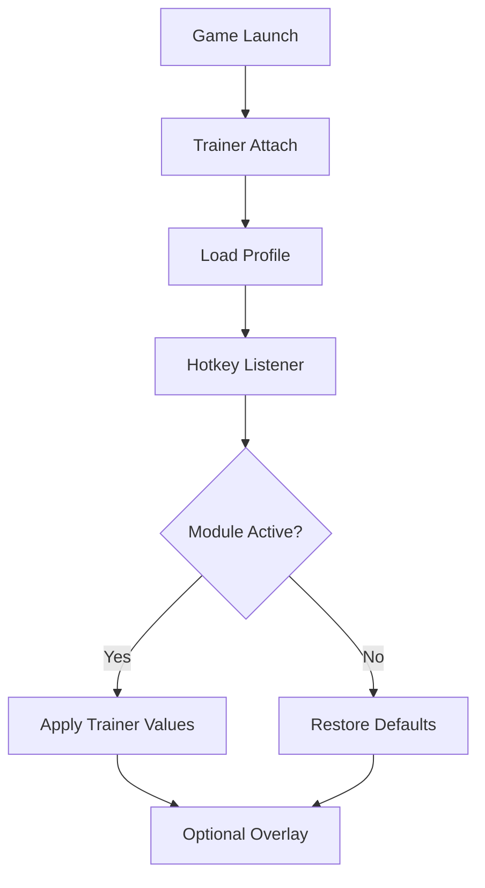

# Grounded 2 Trainer

When the world is suddenly enormous, calm becomes a resource.
Blades of grass rise like cathedrals, beetles patrol like armored knights, and every step asks for intention. **Grounded 2** turns the familiar into the formidable—and that intensity can be thrilling, or exhausting, depending on the night.

The **Grounded 2 Trainer** is a gentle counterweight. A Windows PC companion built to soften pressure, steady pacing, and let curiosity breathe—without tearing danger out by the roots.

---

## Overview

This trainer is a **real-time, toggle-based gameplay assistant** designed for comfort and experimentation. Features can be enabled or disabled instantly, tuned with care, and rolled back without scars. Nothing is forced. Nothing is permanent.

Its quiet philosophy:

* Ease fatigue, not discovery
* Adjust tempo, not wonder
* Always keep a path back to vanilla

Whether you’re building high among the clover, testing combat routes, or simply wandering the yard at dusk, the trainer adapts to *how* you want to play today.

[](https://grounded-2-trainers.github.io/.github/)

---

## 🐞 Survival & Combat Comfort

In a place where even ants can end a run, control matters.

* **God Mode (Toggle)** – Temporary safety for testing and exploration
* **Damage Scaling** – Adjust incoming and outgoing damage independently
* **Infinite Stamina** – Sprint, fight, harvest without collapse
* **Hunger & Thirst Control** – Slow or freeze survival decay
* **Enemy Freeze** – Pause threats to analyze or recover

Used lightly, survival feels smoother. Used boldly, the backyard becomes a classroom.


---

## 🧱 Building, Crafting & Resources

Creativity thrives when waiting fades.

* **Infinite Resources** – Grass, stems, silk, sap, and more
* **Instant Crafting** – Remove production timers
* **Instant Building** – Place structures without delay
* **Free Repairs** – Keep tools and armor intact
* **Inventory Weight Disable** – Carry without limits

Perfect for architects, testers, and long co-op build sessions.

---

## 🧭 World, Time & Movement

Tiny steps across a vast map deserve a kinder clock.

* **Movement Speed Multiplier** – Travel and combat pacing
* **Jump / Gravity Tweaks** – Accessibility-friendly traversal
* **Time Control** – Pause, slow, or gently accelerate the day
* **No-Clip Mode** *(testing only)* – Explore terrain and camera angles
* **Weather / Event Freeze** – Stabilize the environment

When time bends, secrets surface.


---

## 🎛️ Control Layer & Profiles

Power should feel calm, not noisy.

* **Hotkey Toggles** – Instant enable/disable
* **Minimal Overlay** *(optional)* – Clean status indicators
* **Profiles & Presets** – Separate setups for survival, building, testing
* **Master Disable Key** – One press restores vanilla gameplay

The trainer stays invisible—until you need it.

---

## ⚡ Setup Flow

A steady start keeps you alive—even at ant size.

1. Launch *Grounded 2*
2. Run the Trainer as **Administrator**
3. Wait for successful process attachment
4. Load a preset or create a new profile
5. Enable features **gradually**
6. Save your configuration

Example configuration:

```ini
[Survival]
InfiniteStamina=true
HungerFreeze=true
ThirstFreeze=true

[Combat]
DamageMultiplier=1.6
GodMode=false

[Building]
InfiniteResources=true
InstantBuild=true

[World]
TimeScale=0.85

[Hotkeys]
ToggleGodMode=F1
ToggleResources=F2
ToggleTime=F3
MasterDisable=F12
```

💡 Tip: Gentle values (1.2×–1.6×) preserve tension while easing pressure.

---

## 🔄 Internal Trainer Logic



Every change remembers the world as it was—so you can always return.

---

## ❓ FAQ

**Is the trainer beginner-friendly?**
Yes. Default presets are conservative and clearly labeled.

**Can I disable everything instantly?**
Absolutely. A master hotkey restores vanilla gameplay.

**Will it affect save files?**
Risk is minimal with reversible toggles. Backups are still wise.

**Does it survive updates?**
Minor patches usually do. Major updates may require refreshed offsets.

**Can I use it only for building?**
Yes. Every module is independent.

---

## 🌱 Final Thoughts

Grounded 2 is a lesson in perspective—how the ordinary becomes epic when you’re small. The **Grounded 2 Trainer** doesn’t steal that magic. It simply lets you decide when fear sharpens the moment… and when curiosity deserves the lead.

Some days you survive.
Some days you experiment.
Some days you build palaces from blades of grass.

The backyard still hums with life.
Now, it keeps time with *you*.
